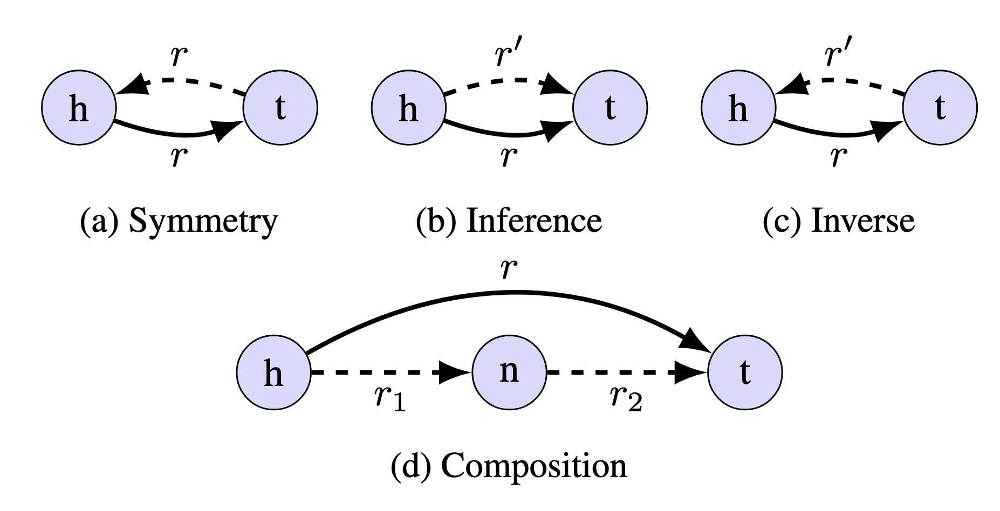

# KG Topology Toolbox

[](https://github.com/psf/black)


`kg-topology-toolbox` is a Python-based toolbox for computing topological properties of Knowledge Graphs (KGs). This library provides researchers and practitioners with tools to better understand the structural characteristics of KGs and how they might impact the predictive performance of any models trained upon them.

`kg-topology-toolbox` enables computation of a variety of properties of KGs, focusing on **edge topological (symmetry, inverse, inference, loop and composition) and cardinality patterns (one-to-one, one-to-many, many-to-one & many-to-many).** 

Unlike other libraries, `kg-topology-toolbox` provides the ability to compute these properties at the level of individual triples, as well as at the level of relations.



---

Full documentation can be found at https://graphcore-research.github.io/kg-topology-toolbox/

> For a walkthrough of the main functionalities of `kg-topology-toolbox`, we provide an introductory [Jupyter notebook](docs/source/notebooks/ogb_biokg_demo.ipynb). 

## Installation

The library has been tested on Ubuntu 20.04 & MacOS >= 14 and has been developed targetting Python >=3.9 - however it should be widely compatible with other systems.

To install the latest version of `kg-topology-toolbox` library, run:

```
pip install wheel
pip install git+https://github.com/graphcore-research/kg-topology-toolbox.git
```

If you would like to be able to change the source code and have the changes reflected in your environment, you can clone the repository and install the package in editable mode run:

```
git clone https://github.com/graphcore-research/kg-topology-toolbox.git
cd kg-topology-toolbox
pip install -e .
```

## Usage

Once installed, the library can be imported as follows:

```python
from kg_topology_toolbox import KGTopologyToolbox
```

`kg-topology-toolbox` requires that the input KG is in the form of a pandas DataFrame with suggested column names of `h`, `r` and `t`. The `h` and `t` columns should contain the head and tail entities involved in the triple, and the `r` column should contain the relation type. These columns should be the integer identifiers of the entities and relations in the KG. Note that if your columns are named differently, you can specify the column names when creating the `KGTopologyToolbox` object.

For example, we can load a KG from a CSV file:

```python
import pandas as pd
df = pd.read_csv("path/to/kg.csv", columns=["h", "r", "t"])
```

This can then be used to instantiate a `KGTopologyToolbox` object:

```python
kgtt = KGTopologyToolbox(df)
```

### Computing Edge Topological Patterns

The `KGTopologyToolbox` object can be used to compute the topological properties of the KG. For example, to compute the edge patterns of the KG, we can use the `edge_pattern_summary` method:

```python
edge_eps = kgtt.edge_pattern_summary()
```

This will return a DataFrame with the edge patterns of the KG, where values have been computed for each edge contained with the graph. The values contained in the DataFrame include: 

  - **is_loop**: True if the triple is a loop (``h == t``).
  - **is_symmetric**: True if the triple (t, r, h) is also contained in the graph (assuming t and h are different).
  - **has_inverse**: True if the graph contains one or more triples (t, r', h) with ``r' != r``.
  - **n_inverse_relations**: The number of inverse relations r'.
  - **inverse_edge_types**: All relations r' (including r if the edge is symmetric) such that (t, r', h) is in the graph.
  - **has_inference**: True if the graph contains one or more triples (h, r', t) with ``r' != r``.
  - **n_inference_relations**: The number of inference relations r'.
  - **inference_edge_types**: All relations r' (including r) such that (h, r', t) is in the graph.
  - **has_composition**: True if the graph contains one or more triangles supported on the edge: (h, r1, x) + (x, r2, t).
  - **n_triangles**: The number of triangles.
  - **has_undirected_composition**: True if the graph contains one or more undirected triangles supported on the edge.
  - **n_undirected_triangles**: The number of undirected triangles (considering all edges as bidirectional).
  - **metapath_list**: The list of unique metapaths "r1-r2" for the directed triangles.

### Computing Edge Cardinality Patterns

Similarly, to compute the cardinality patterns of the KG, we can use the `edge_degree_cardinality_summary` method:

```python
edge_dcs = kgtt.edge_degree_cardinality_summary()
```

This will return a DataFrame with the cardinality patterns of the KG, where again values have been computed for each edge contained with the graph. The DataFrame contains the following columns:


  - **h_unique_rel**: Number of distinct relation types among edges with head entity h.
  - **h_degree**: Number of triples with head entity h.
  - **h_degree_same_rel**: Number of triples with head entity h and relation type r.
  - **t_unique_rel**: Number of distinct relation types among edges with tail entity t.
  - **t_degree**: Number of triples with tail entity t.
  - **t_degree_same_rel**: Number of triples with tail entity t and relation type r.
  - **tot_degree**: Number of triples with head entity h or tail entity t.
  - **tot_degree_same_rel**: Number of triples with head entity h or tail entity t, and relation type r.
  - **triple_cardinality**: cardinality type of the edge.
  - **triple_cardinality_same_rel**: cardinality type of the edge in the subgraph of edges with relation type r.

### Aggregating by Relation

It is also possible to aggregate the properties at the level of relations, you can use the `aggregate_by_relation` method:

```python
from kg_topology_toolbox.utils import aggregate_by_relation

relation_eps = aggregate_by_relation(edge_eps)
relation_dcs = aggregate_by_relation(edge_dcs)
```

This will return a DataFrame with statistics for the edge properties, aggregated across edges of the same relation type, for all relations contained within the graph.


**For a more detailed overview of the functionalities of `kg-topology-toolbox`, please refer to the [documentation](https://graphcore-research.github.io/kg-topology-toolbox/) and the introductory [Jupyter notebook](docs/source/notebooks/ogb_biokg_demo.ipynb).**

## Citation

If you have found this package useful in your research, please consider citing
[our paper](https://arxiv.org/abs/2409.04103):

```bibtex
@article{cattaneo2024role,
  title={The Role of Graph Topology in the Performance of Biomedical Knowledge Graph Completion Models},
  author={Cattaneo, Alberto and Bonner, Stephen and Martynec, Thomas and Luschi, Carlo and Barrett, Ian P and Justus, Daniel},
  journal={arXiv preprint arXiv:2409.04103},
  year={2024}
}
```

## License

Copyright (c) 2023 Graphcore Ltd. Licensed under the MIT License.

The included code is released under the MIT license (see [details of the license](LICENSE)).

See [notices](NOTICE.md) for dependencies, credits, derived work and further details.
